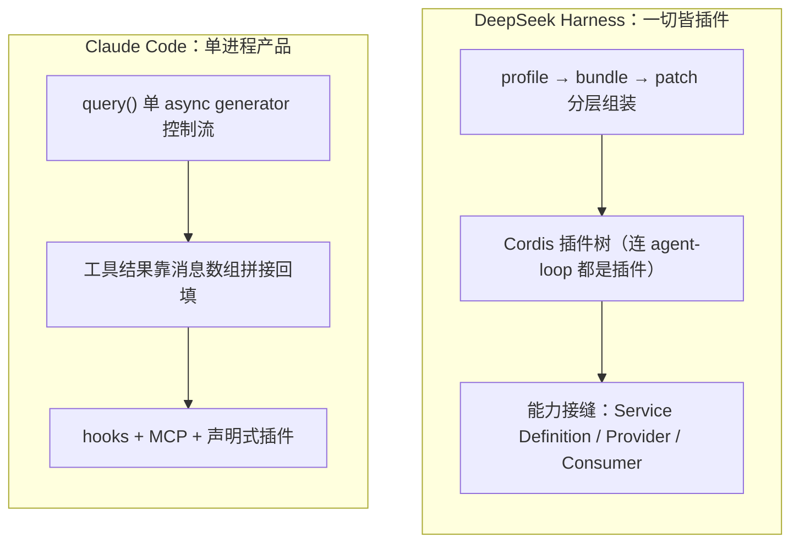

# DeepSeek Harness vs Claude Code 源码深度对比

> **一句话结论**：DeepSeek Harness（dsh）是一个「一切皆插件」的可嵌入 agent 运行时框架——连 agent 循环、工具注册表、会话日志、模型适配器本身都是可替换插件；Claude Code 是一个深度绑定 Anthropic、把产品体验打磨到极致的终端产品。两者同属 AI 编码 CLI，却分别走向「框架化」与「产品化」两个相反极端。

## 先说结论

1. **扩展模型相反**：dsh 用 Cordis 插件树 + 能力接缝（Service Definition / Provider / Consumer），扩展 = 加一行插件配置；Claude Code 用 hooks（25+ 事件）+ 声明式插件 + MCP。
2. **工具系统**：dsh 强制 canonical JSON 输出、五段瀑布管线、逻辑与 UI 分离；Claude Code 用 Zod schema + checkPermissions + hooks，React 渲染内嵌在工具里。
3. **权限**：dsh 是可替换 approval seam + 平台沙箱链（bwrap / landlock / seatbelt）；Claude Code 是规则集 + 工具自检 + AI 分类器 + 多路竞争裁决。
4. **子代理**：dsh 是六 provider 接缝，能把 Claude Code / Codex 当子代理；Claude Code 复用 query() + swarm。
5. **会话真相**：两者都以持久化日志为真相，dsh 更形式化（append-only + 可执行不变量「模型可见 ⟺ 已记录」）。

## 架构哲学对比

## 关键维度速览

| 维度 | DeepSeek Harness | Claude Code |
|---|---|---|
| 本质 | 可嵌入的 agent 运行时框架 | 深度绑定 Anthropic 的终端产品 |
| 运行时 | TypeScript(ESM) + Python SDK | TypeScript + Bun |
| UI | Web-first + CLI + headless + ACP | 终端 TUI（自研 Ink fork） |
| 扩展模型 | Cordis 插件树 + 能力接缝 | hooks + MCP + 声明式插件 |
| 工具系统 | 五段瀑布管线 + canonical output | checkPermissions + hooks |
| 会话真相 | append-only session log | JSONL transcript + sidechain |
| 子代理 | 多 provider 接缝（含 Codex / Claude Code） | 复用 query() + swarm |
| 许可证 | MIT | 专有（研究快照） |

## 文档目录

- [01 深度对比](docs/01-comparison.md) — 10 大维度逐项对比 + 双方独特设计决策
- [02 DeepSeek Harness 架构解读](docs/02-dsh-architecture.md) — Cordis 插件模型、agent 循环、会话日志、能力接缝、权限沙箱、RPC
- [03 Claude Code 源码解读](docs/03-claude-code.md) — 查询循环、工具系统、权限、hooks、终端 UI

## 源码来源

- **DeepSeek Harness**：[deepseek-ai/deepseek-harness](https://github.com/deepseek-ai/deepseek-harness)（MIT 开源，官方仓库）
- **Claude Code**：研究快照，上游 [ultraworkers/claw-code](https://github.com/ultraworkers/claw-code)（通过 npm source map 泄露重建，约 1900 文件 / 51 万行）

> 本分析由源码精读产出，所有结论落到具体文件路径与导出符号；详见 docs/ 各章。
