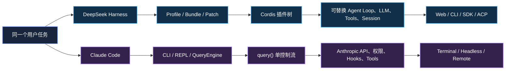
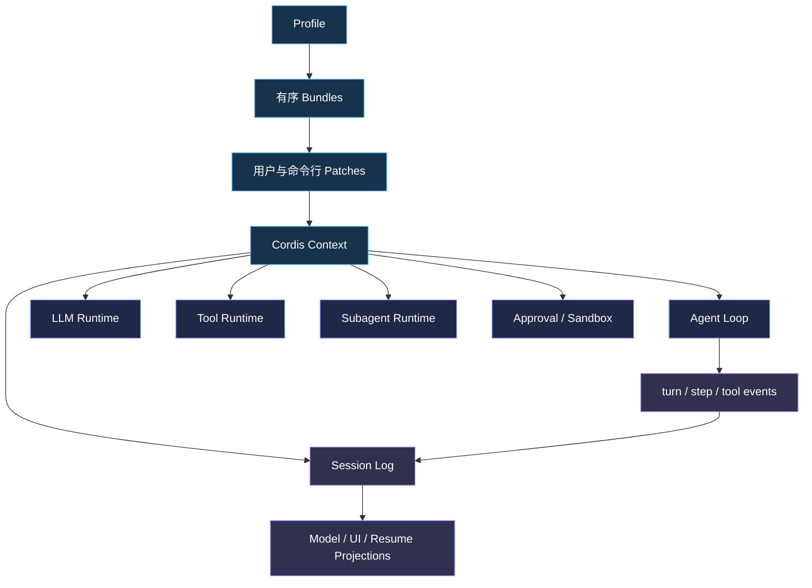
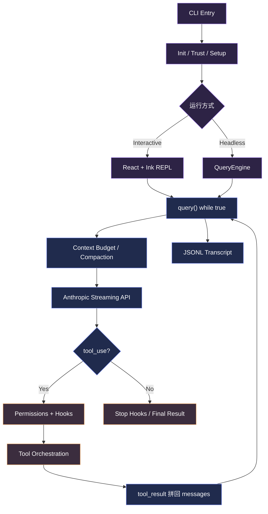
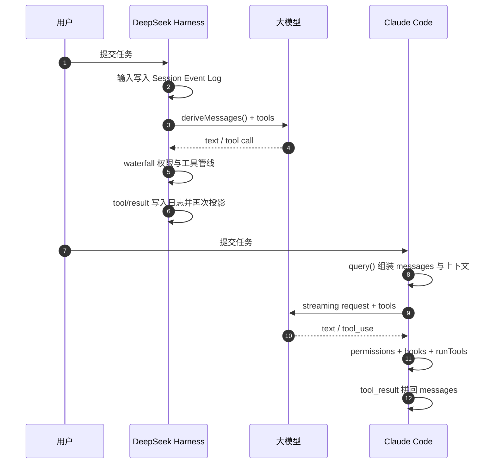

<p align="center">
  
</p>

<h1 align="center">DeepSeek Harness vs Claude Code</h1>

<p align="center">
  <strong>从源码出发，拆解两种 AI Coding Agent 的架构路线</strong><br />
  可组合的 Agent 运行时框架，与深度产品化的终端编码代理
</p>

<p align="center">
  
  
  
  
</p>

---

## 这个项目解决什么问题？

AI Coding Agent 看起来都在做同一件事：理解任务、调用模型、执行工具、修改代码。但真正决定系统能力上限的，是循环背后的架构：

- 模型、工具、会话和权限是不是可以替换？
- 工具结果怎样回到模型上下文？
- 危险命令在哪里被拦截，授权如何传播？
- 对话太长时怎样压缩，进程崩溃后怎样恢复？
- 子代理是同一内核的分身，还是可替换的异构执行引擎？
- 系统更适合做平台，还是更适合做一个完整产品？

本项目通过源码级分析，对比 **DeepSeek Harness（dsh）** 与 **Claude Code** 的完整执行链。目标不只是告诉你“它们有什么功能”，而是解释：

> **这些功能为什么以这种方式存在，它们如何组合，以及每种选择付出了什么代价。**

## 结论先行

| | DeepSeek Harness | Claude Code |
|---|---|---|
| 一句话定位 | 可嵌入、可重组的 Agent 运行时框架 | 深度绑定 Anthropic 的终端编码产品 |
| 核心思想 | Everything is a plugin | 一个 `query()` 控制完整产品流 |
| 优先优化 | 可替换性、可审计性、多端嵌入 | 终端体验、启动性能、缓存与权限体验 |
| 扩展方式 | Cordis 插件树、能力接缝、typed events | Hooks、MCP、Skills、声明式插件 |
| 会话模型 | Append-only Event Log + Surface Projection | Messages + JSONL Transcript + Sidechain |
| 子代理模型 | 多 Provider，可接入 Codex / Claude Code | AgentTool 复用同一个 `query()` |

最核心的区别可以浓缩为一句话：

> **DeepSeek Harness 在设计“如何组装 Agent”；Claude Code 在设计“如何把一个 Agent 产品做到极致”。**



## 两套系统的架构心智模型

### DeepSeek Harness：Agent 是一棵可装配的插件树

在 dsh 中，模型适配器、工具注册表、会话日志和 Agent Loop 本身都不是不可替换的“内核”。它们是挂在 Cordis Context 上的服务，通过 Profile、Bundle 和 Patch 组装成一个实际运行的产品。



它适合需要以下能力的团队：

- 替换模型供应商、沙箱实现或持久化后端；
- 在 Web、CLI、SDK 与自动化协议之间复用同一运行时；
- 把 Codex、Claude Code 或另一个 dsh 实例作为子代理；
- 用事件日志、不变量和投影获得可审计、可重放的会话。

### Claude Code：围绕 `query()` 打磨的产品控制系统

Claude Code 的核心是一条高度集中、持续优化的 async generator 控制流。REPL、Headless SDK 和子代理都复用这条循环，因此工具、压缩、Fallback、Hooks 和流式输出可以保持一致。



它集中优化的是完整产品体验：

- 工具排序、缓存断点和压缩策略共同维护 Prompt Cache；
- 权限由规则、工具自检、安全红线、Hooks、分类器和交互层共同裁决；
- 自研 Ink / Terminal 栈承载 Diff、Vim、任务面板和权限弹窗；
- AgentTool 复用 `query()`，天然继承主循环的全部成熟能力。

## 一次请求如何走完？

两者共享“模型 → 工具 → 结果回填 → 再问模型”的基本循环，但状态与控制点不同：



更精确的生命周期、权限、持久化和子代理图，见 [04 可视化深度架构指南](docs/04-visual-architecture-guide.md)。

## 关键差异

| 维度 | DeepSeek Harness | Claude Code | 对架构设计的启发 |
|---|---|---|---|
| Agent 循环 | `turn / step` 事件驱动状态机 | `queryLoop while(true)` | 扩展点形式化 vs 控制流集中化 |
| 工具契约 | Canonical JSON Output + 纯函数 Render | Zod + `call()` + React Render Hooks | 可回放跨端数据 vs 产品内聚 |
| 权限 | `tools/pre-execute` + Approval Seam | Rules + Tool Check + Hooks + Classifier | 可替换策略边界 vs 多层体验优化 |
| 沙箱 | 独立 Sandbox Provider，平台链 Fail-closed | 工具权限与产品安全检查深度集成 | 基础设施能力 vs 产品安全策略 |
| 会话 | 事件日志是唯一事实源 | 内存 Messages + JSONL Transcript | 事件溯源投影 vs 直接消息流 |
| 压缩 | 可替换 Compaction Seam | 多级压缩 + Prompt Cache 联动 | 模型无关能力 vs Provider 深度优化 |
| 子代理 | 多 Provider、可续跑、可冷恢复 | 复用 `query()` + Task / Swarm | 异构编排 vs 同构复用 |
| 客户端 | Web-first + Typed RPC + SDK / ACP | Terminal-first + IDE / Remote Bridge | 多端嵌入 vs 单端深挖 |
| 扩展 | Service / Provider / Consumer + Events | Hooks / MCP / Skills / Plugins | 重组运行时 vs 扩展固定产品 |

## 文档导航

| 文档 | 适合谁 | 你会读到什么 |
|---|---|---|
| [00 给 AI 学习者的导读](docs/00-ai-learning-guide.md) | 第一次了解 Coding Agent | Agent Loop、工具、日志、子代理等核心概念的大白话解释 |
| [01 源码深度对比](docs/01-comparison.md) | 想快速比较两套系统 | 10 个维度的逐项对照、关键设计决策与文件索引 |
| [02 DeepSeek Harness 架构解读](docs/02-dsh-architecture.md) | Agent 平台与框架开发者 | Cordis、Session Event Log、Capability Seam、沙箱、RPC、SDK |
| [03 Claude Code 源码解读](docs/03-claude-code.md) | Coding Agent 产品开发者 | `query()`、Tools、Permissions、Hooks、Compaction、TUI、Swarm |
| [04 可视化深度架构指南](docs/04-visual-architecture-guide.md) | 希望先看图再读源码 | 20 张架构图串起启动、运行、安全、状态、压缩、子代理和扩展 |

## 推荐阅读路线

### AI 应用从业者

`00 导读 → 04 可视化指南 → 01 深度对比`

先建立 Agent 系统的心智模型，再理解两种路线的区别，不需要预先掌握复杂工程概念。

### Agent 架构与平台开发者

`README → 01 深度对比 → 02 dsh → 03 Claude Code`

重点关注能力接缝、会话状态、工具执行、权限边界与扩展模型。

### 准备继续阅读源码

`04 可视化指南 → 02 / 03 关键文件速查表 → 沿一次真实请求追调用链`

不要从目录开始逐文件阅读；先确定入口、主循环、工具管线、会话真相和扩展边界。

## 项目结构

```text
.
├── README.md
├── assets/
│   └── harness-architecture-hero.png
└── docs/
    ├── 00-ai-learning-guide.md
    ├── 01-comparison.md
    ├── 02-dsh-architecture.md
    ├── 03-claude-code.md
    └── 04-visual-architecture-guide.md
```

## 分析对象与方法

### DeepSeek Harness

- 上游：[deepseek-ai/deepseek-harness](https://github.com/deepseek-ai/deepseek-harness)
- 定位：MIT 开源的 Agent 运行时框架
- 分析范围：Cordis、Agent Loop、Tools、Session、LLM、Sandbox、Subagent、Workflow、Typert、Web / SDK

### Claude Code

- 研究快照来源：[ultraworkers/claw-code](https://github.com/ultraworkers/claw-code)
- 定位：Anthropic 专有终端产品的研究快照
- 分析范围：CLI Entry、`query()`、Tools、Permissions、Hooks、Compaction、Session Storage、Ink TUI、Agent / Swarm

### 分析原则

- 结论尽量落到具体文件路径、导出符号和运行流程；
- 区分源码事实、架构归纳与基于证据的推断；
- 不用功能列表代替架构解释；
- 图负责建立关系，源码负责确认细节；
- 上游实现变化时，以对应版本源码、测试和实际行为为准。

## 适合谁？

- 正在设计 Coding Agent、Agent Runtime 或 AI IDE 的工程师；
- 需要选择“自建框架”还是“集成产品”的技术负责人；
- 想理解工具调用、权限、上下文压缩和子代理实现的 AI 从业者；
- 希望从真实大型 Agent 工程中学习架构取舍的开发者。

## 说明

本仓库是独立的源码学习与架构分析项目，不代表 DeepSeek 或 Anthropic 官方立场。Claude Code 相关内容基于研究快照，仅用于技术研究；产品行为和内部实现可能随版本变化。

如果这份分析帮助你建立了更清晰的 Agent 架构心智模型，欢迎 Star、提交 Issue，或补充新的实现证据。
