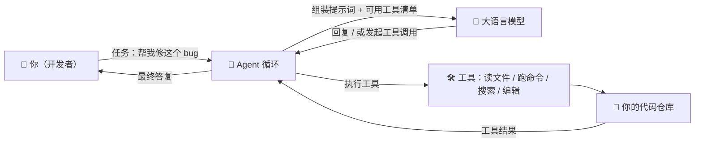
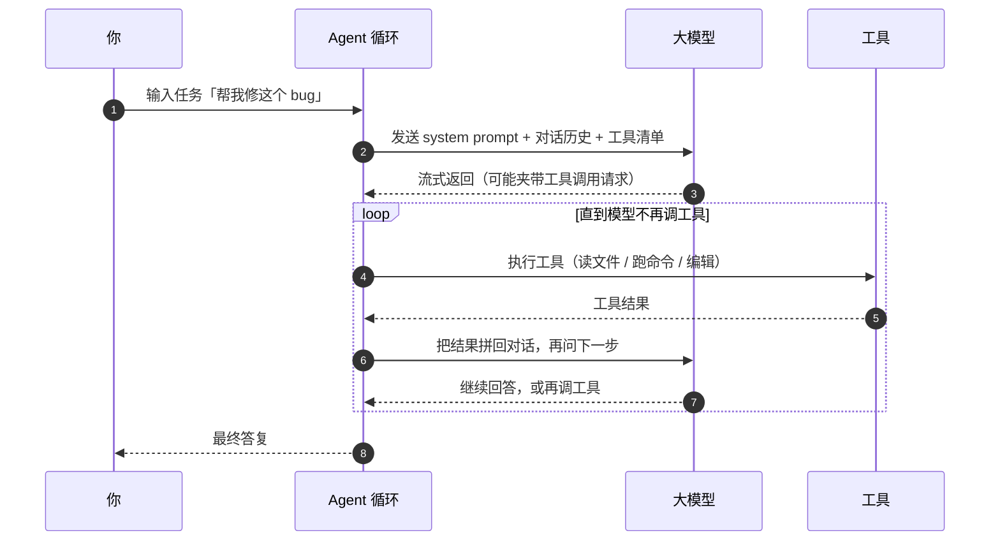
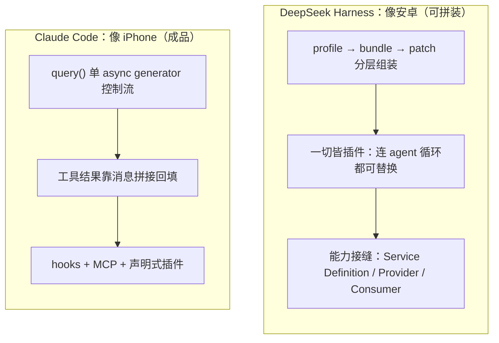

# 给 AI 学习者的导读

> 这篇导读用大白话把「AI 编码代理」讲清楚，配合图解释 DeepSeek Harness 和 Claude Code 两套系统。**先看懂这篇，再去读 01 / 02 / 03 的工程细节会轻松很多。** 工程细节都保留了，只是这里先建立直觉。

## 1. 什么是「AI 编码代理」？

AI 编码代理（AI Coding Agent）是一个**能自己动手改代码的 AI 程序**。它不只是「聊天回答你」，而是会：

1. 读你的代码仓库；
2. 执行命令（跑测试、查报错）；
3. 修改文件；
4. **反复循环直到任务完成**，而不是一次性回答。

它和普通聊天机器人的区别在于：聊天机器人「说」，编码代理「做」。

## 2. 一次请求是怎么走完的？

下面这张时序图，是任何 AI 编码代理的**通用骨架**（DeepSeek Harness 和 Claude Code 都一样，只是实现细节不同）：

**关键点**：模型的每一步回答，都可能夹带「我要调用哪个工具、参数是什么」。Agent 循环负责执行这些工具调用，把结果拼回对话，再喂给模型。这个「问 → 做 → 再问」的循环，就是「Agent 循环」。

## 3. 需要先懂的 10 个核心概念

| 概念 | 大白话解释 | 在哪深挖 |
|---|---|---|
| **Agent 循环** | 反复「问模型 → 执行工具 → 结果回填 → 再问」，直到完成 | 01、02、03 |
| **工具（Tool）** | 模型能调用的动作：读文件、跑 bash、搜索、编辑 | 01、03 |
| **System Prompt** | 发给模型的「身份说明书 + 可用工具清单 + 规则」 | 02、03 |
| **会话日志（Session Log）** | 把发生过的每件事按顺序记下来，作为「唯一真相」 | 02 |
| **插件（Plugin）** | 可插拔的功能模块，装上就生效、卸掉就消失 | 02 |
| **子代理（Subagent）** | 主代理派出去干活的「分身」，干完回来汇报 | 01、02、03 |
| **MCP** | 连接外部工具 / 服务的通用协议（跨产品标准） | 03 |
| **Hook** | 挂在关键节点上的「钩子」，能拦截、改写、阻断 | 03 |
| **沙箱（Sandbox）** | 限制 AI 只能动哪些文件 / 目录的「安全边界」 | 02 |
| **压缩（Compaction）** | 对话太长时自动「总结旧内容」腾出上下文空间 | 01、02、03 |

## 4. 两套系统一句话对比

- **DeepSeek Harness**：把「Agent 循环、工具、日志、模型」这些骨架**全部做成可插拔的插件**，谁都能替换——像「安卓系统」，你可以自己拼装一台 Agent。
- **Claude Code**：把这些东西**打磨成一个开箱即用、体验极致的成品**——像「iPhone」，好用但内部高度封闭。

## 5. 建议阅读路线

1. **先读本页**（你在这里）——建立「Agent 循环 / 工具 / 日志」的直觉。
2. **读 [04 可视化深度架构指南](04-visual-architecture-guide.md)**——顺着总览、一次请求、工具权限、会话恢复、子代理，把两套系统完整走一遍。
3. **读 [01 深度对比](01-comparison.md)**——看两套系统在工具、权限、子代理、会话上的逐项差异。
4. **读 [02 DeepSeek Harness 架构解读](02-dsh-architecture.md)**——深入「一切皆插件」「会话日志即真相」「沙箱链」。
5. **读 [03 Claude Code 源码解读](03-claude-code.md)**——深入「查询循环」「权限 + hooks」「自研终端 UI」。

> 每篇正文都保留了工程级细节（具体文件路径、导出符号），看不懂的地方可以先跳过，回到本页的概念表对照着读。

## 6. 看工程文档时，把术语翻译成五个普通问题

| 工程术语 | 先问自己的普通问题 |
|---|---|
| `queryLoop` / `ReactLoopAgent` | 谁决定“继续问模型还是结束”？ |
| waterfall / hook | 谁能在关键节点拦截、修改或拒绝？ |
| session log / transcript | 程序崩溃后，靠什么恢复刚才发生的事？ |
| provider / adapter / MCP | 想换实现或接外部能力，要从哪里插进去？ |
| scope / permission context / sandbox | 这个 Agent 到底能看到什么、能做什么？ |

带着这五个问题读源码，会比按目录逐个文件阅读更容易形成完整架构图。
