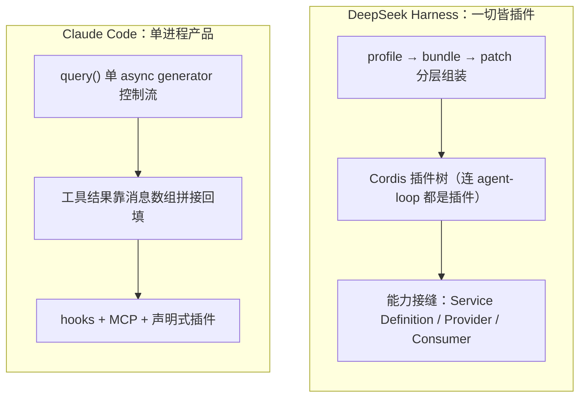
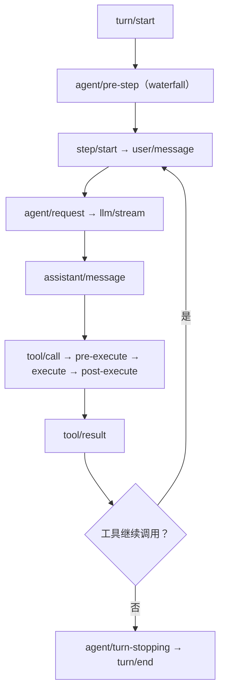
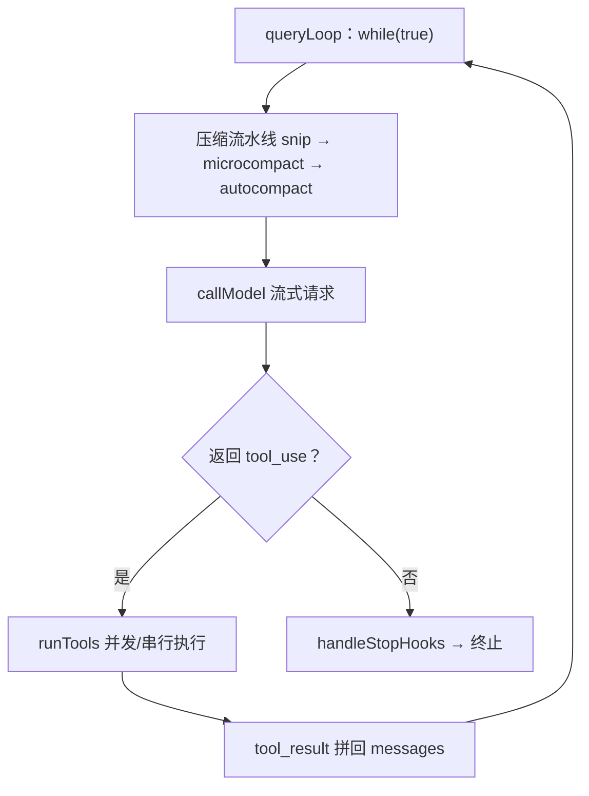
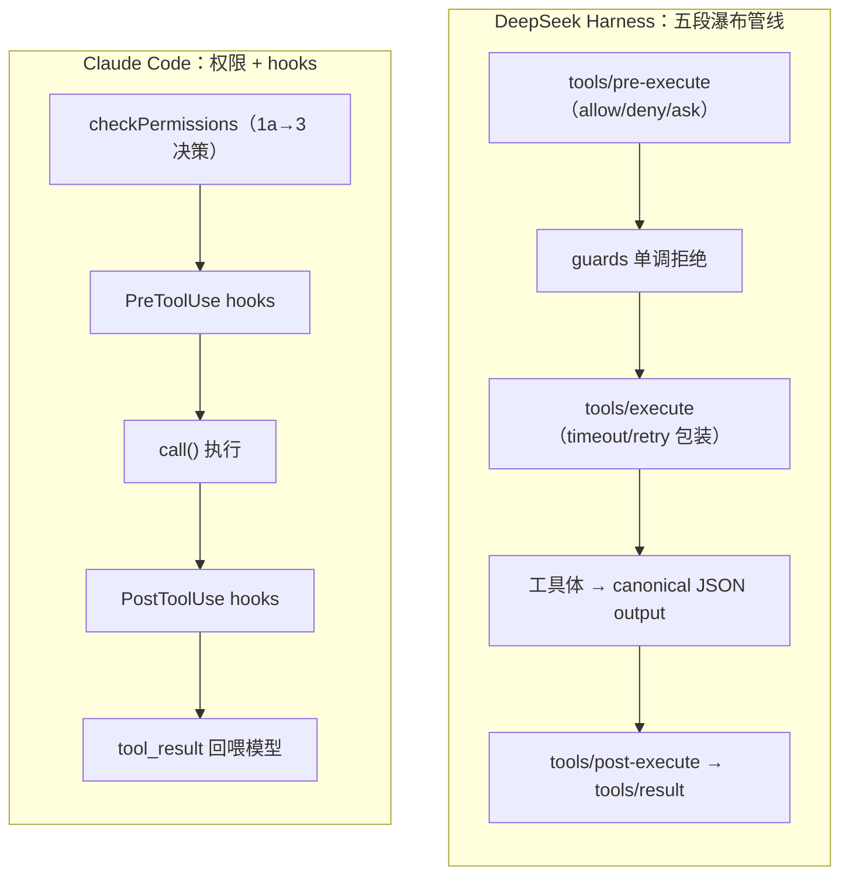

# DeepSeek Harness vs Claude Code — 源码深度对比报告

> **核心结论**：dsh 走「框架化」路线（一切皆插件、可组合、可嵌入），Claude Code 走「产品化」路线（性能极致、深度绑定 Anthropic）。两者在工具、权限、子代理、会话上的差异，本质是「可替换能力接缝」与「产品级深度打磨」的分野。

> 分析对象：
> - **DeepSeek Harness (`dsh`)**：`/Users/bytedance/deepseek-harness`（官方 `deepseek-ai/deepseek-harness`，MIT，约 2085 个 TS 文件，pnpm monorepo，Cordis 插件框架，另含 Python SDK 与 native Landlock 沙箱）
> - **Claude Code**：`/Users/bytedance/Documents/harness/claude-code`（用户 fork 自 `ultraworkers/claw-code`，Anthropic 官方源码快照，1902 文件 / 512,664 行 TS，Bun 运行时，React + 自研 Ink 终端 UI）

---

## 0. 一句话定性

| | DeepSeek Harness | Claude Code |
|---|---|---|
| **本质** | 一个**可嵌入的 agent 运行时框架**（"everything is a plugin"） | 一个**深度绑定 Anthropic 的终端产品** |
| **扩展模型** | Cordis 插件树 + 能力接缝（任何部件可替换） | Hook 事件 + 声明式插件 + MCP |
| **语言/运行时** | TypeScript(ESM) + Python SDK，Node 22+/24 | TypeScript，Bun 专属 |
| **UI** | Web UI（React）+ CLI + headless + ACP | 终端 TUI（自研 Ink fork） |
| **许可证** | MIT（开源） | Anthropic 专有（本快照仅研究用） |

**核心差异一句话**：dsh 把"agent 循环、工具注册表、会话日志、模型适配器"这些**骨架全部做成了可替换插件**，目标是成为"agent 界的 Android"；Claude Code 则把**产品体验做到极致**（启动性能、prompt cache、权限审批、终端 UI），架构服务于单一产品的工程效率。

---

## 1. 总体架构哲学

### DeepSeek Harness：一切皆插件（Cordis）

- 底层是 **vendored 的 Cordis**（`vendor/cordis`，其设计见论文《A Programming Paradigm for Spatiotemporal Composability》）。
- 一个运行中的 `dsh` 是一棵**插件树**，由有序的 **profile → bundle → patch** 层层组装：
  - **profile**：命名组合（`web`/`headless` 是内置模板），声明它堆叠哪些 bundle、装了哪些外部插件、持有用户 `cordis.patch.yml`。
  - **bundle**：Cordis 配置行 + 代码的分发格式（`dsh-base` 是所有 profile 的第一层：模型/工具/持久化/沙箱/审批/设置/凭据/遥测）。
  - 每一层 patch 可以按 row id **替换任意一个插件的完整配置**——所以连"模型路由"都是可 patch 的配置。
- **没有特权核心可改**：连 model adapter、tool registry、session log、agent loop 本身都是插件。注册是**可逆 effect**，插件卸载时自动 unwind。
- 关键机制（`docs/glossary.md`）：
  - **capability seam（能力接缝）** = Service Definition（声明接口，`ctx.<key>`）+ Service Provider（实现）+ Consumer（消费，通常是模型可见工具）三角色。典型例：`dsh-shell`(定义) / `dsh-bash-local`+`dsh-bash-sandbox`(提供者) / `dsh-tool-bash`(消费者)。
  - **agent-scope**：每个 agent 有自己的作用域，工具/提示段/变量可全局注册或按 scope 注册（shadowing = 就近覆盖）。

### Claude Code：单进程产品，模块化而非插件化

- 一个 **async generator 单控制流**：`query.ts queryLoop`（`while(true)` 状态机），REPL 和 headless/SDK 都消费同一条事件流。
- 无框架插件内核；扩展靠 **hooks（25+ 事件）**、**声明式插件 manifest**（无 JS main）、**MCP**。
- 状态管理是**模块级全局状态池**（`bootstrap/state.ts` 1758 行，无框架 getter/setter）+ React zustand 风格 store 双层，避免 prop-drilling——工程实用主义优先。

---

## 2. Agent 循环

### dsh：turn/step 事件驱动状态机

`packages/core/agent-loop`（`AgentLoop` 工厂，`ReactLoopAgent` 机器）。架构文档定义的流：

```text
turn/start
  claim next-step input + one queued message
  assemble prompt sections + tool schemas
  -> agent/pre-step   (waterfall: reject | enter(messages))
     step/start
     agent/request -> llm/stream -> assistant/chunk* -> assistant/message
     tool/call* -> tools/pre-execute -> tools/execute -> tools/post-execute -> tool/result*
     step/end
  -> agent/turn-stopping (serial)
turn/end
```

- **step** = 一次模型请求 + 它触发的工具执行；**turn** = 零或多个 step。
- 所有模型可见输入都从 **append-only session log** 投影（`deriveMessages()`），并有运行时不变式断言 **"model-visible ⟺ logged"**。
- 扩展点分三个域：durable session events（`turn/*`、`user/message`、`assistant/*`、`tool/*`）、live agent events（`agent/*`）、capability events（`fs/*`、`tools/*`）。`pre-step`/`request`/`llm-stream`/三个 `tools/*` 是 **waterfall**（必须 `next()`），`turn-stopping` 是 serial。

### Claude Code：query() 消息数组循环

`query.ts queryLoop`（1729 行，`while(true)`）：

1. 上下文预算流水线（snip → microcompact → contextCollapse → autocompact）
2. `callModel` 流式请求（`services/api/claude.ts`，raw Stream 而非 BetaMessageStream）
3. 工具执行（`runTools` 把并发安全的只读批并发跑，非只读串行）
4. **工具结果靠消息数组拼接回填**：`state.messages = [...messages, ...assistantMessages, ...toolResults]` 再进下一轮——**没有独立的 tool loop**
5. 无 tool_use → `handleStopHooks` → 终止

**对比**：dsh 有形式化的 turn/step 边界和三类事件域（为插件扩展点设计）；Claude Code 是单循环 + 消息拼接（为性能和 prompt cache 前缀稳定性设计）。dsh 的"一个 step 内并发工具"由 `maxParallelToolCalls` 调度器（`tool-calls.ts`）管理，Claude Code 由 `partitionToolCalls` 按只读/非只读分批。

---

## 3. 工具系统（核心差异最大处）

### dsh：`ToolDefinition` + canonical output + 五段管线

`packages/core/tools/src/index.ts`（`ToolRuntime`）：

- 工具契约：`{ name, description, parameters, output: { schema, render, presentationMeta? }, execute(args, exec), finalizeContent?, timeoutMs?, isConcurrencySafe?, presentCall?, presentResult? }`。
- **强制 canonical output**：工具必须声明 `output.schema`（JSON Schema），执行体返回**无损 JSON 值**，注册表深冻结、快照；`render` 是纯函数把值投影成模型可见 content block。
- **执行管线**：`tools/pre-execute`（waterfall：allow/deny/ask）→ guard（单调 deny）→ `tools/execute`（around-dispatch waterfall，timeout/retry/metrics 挂这里）→ 工具体 → `tools/post-execute`（accept/replace/block）→ `finalizeContent` → materialize → `tools/result`（emit，深冻结快照）。
- **scoped registry**：工具可全局或按 agent-scope 注册，`restrict({allow, deny})` 按 scope 过滤，guard 按 scope 单调 deny。
- **Code Mode**（独特）：`mode: native | code | both`。`code` 模式下所有工具折叠成**单个 `run_code` 工具** + 生成的 SDK（TypeScript 或 Python），模型写程序而非发原生工具调用；`run_code` 内部子调用（`<parent>:code:<n>`）仍走原生调度。这是 dsh 独有的"让模型编程"呈现方式。

### Claude Code：`Tool` 接口 + Zod + UI 内嵌

`src/Tool.ts`：

- 契约：`{ name, inputSchema(Zod v4), inputJSONSchema?(MCP 直传), call(args, ctx, canUseTool, parentMessage, onProgress), description()/prompt(), isEnabled/isReadOnly/isConcurrencySafe/isDestructive, validateInput?, checkPermissions, interruptBehavior?, ... }` + 一整套 `renderToolUseMessage/renderToolResultMessage/renderToolUseProgressMessage/...` **React 渲染钩子**（UI 与工具逻辑同文件）。
- `buildTool(def)` + `TOOL_DEFAULTS`：fail-closed 默认（`isConcurrencySafe→false`、`isReadOnly→false`、`checkPermissions→allow`）。
- 无 `needsPermissions`（权限靠 `checkPermissions`），无 `isStreamable`（流式靠 `onProgress` 回调）。
- `tools.ts`：`Tools = readonly Tool[]`（数组非 map），`assembleToolPool` 内置 + MCP 按名排序去重——**排序是为了 prompt cache 前缀稳定**。
- 权限规则在**工具列表层面**预剔除（`filterToolsByDenyRules`），模型根本看不到被禁工具。

**对比**：
- dsh 工具**逻辑与 UI 展示分离**（`presentCall/presentResult` 是纯函数、可回放，工具不 import React）；Claude Code 工具**内嵌 React 渲染**。
- dsh 强制 canonical output（无损 JSON + 强校验，违反抛 `ToolOutputError`）；Claude Code 工具输出更自由（`ToolResult<T>`，错误靠 `<tool_use_error>` 字符串回喂）。
- dsh 用 waterfall 事件做扩展；Claude Code 用 `checkPermissions` + hook 做扩展。
- dsh 有 Code Mode（run_code 折叠）；Claude Code 有 ToolSearch（`shouldDefer` 延迟加载工具，模型先用 ToolSearchTool 检索）。

---

## 4. 权限与审批

### dsh：waterfall 决策 + approval seam + 沙箱

- 决策在 `tools/pre-execute` waterfall：`allow / deny / ask`（缺 approval 支持时 ask 降级为 deny）。
- `dsh-user-approval` 是可选 seam：审批服务返回 `allowed-once` 才放行。
- `dsh-permission-presets` 提供权限预设；`fs-observation-policy` 是文件访问观测策略。
- 沙箱是**独立 seam**：`ctx.sandbox` 后端包裹 argv；本地实现 + **native Landlock 沙箱**（`native/landlock-run`，Linux Landlock）；`dsh-fs-sandbox`/`dsh-bash-sandbox`/`dsh-pwsh-sandbox`。
- 审批失败是结构化错误（`HarnessError` + code）。

### Claude Code：规则集 + 工具自检 + 模式状态机 + AI 分类器

`utils/permissions/permissions.ts hasPermissionsToUseTool`（步骤 1a→3）：

1. deny 规则 → 工具自检 `checkPermissions` → `requiresUserInteraction`（bypass 也问）→ 内容级 ask 规则（高于 bypass）→ **safetyCheck**（`.git/`、`.claude/`、shell 配置，**bypass-immune** 必弹窗）
2. bypass 判定 → 整工具 allow 规则
3. passthrough → ask → 交互层

- auto 模式（ant-only）：acceptEdits 快路径 → 安全工具 allowlist → **YOLO 分类器**（小模型裁决当前动作）→ 连续 deny 熔断回退人工。
- 交互层**多路竞争**：本地按键 / hook / 分类器 / CCR 手机端 / 频道，`resolveOnce/claim()` 谁先到谁赢。

**对比**：dsh 的审批是可替换的 seam（更"框架化"），沙箱是独立能力（含真内核级 Landlock）；Claude Code 的权限是产品级深度打磨（规则集、AI 分类器、多端竞争、bypass 红线），更"产品化"。

---

## 5. 子代理 / 多代理

### dsh：SubagentRuntime 接缝 + 多 provider

`packages/subagent/subagent`（`ctx.subagents`）：

- 一个服务 API，多个**命名 provider**决定孩子在**本进程 / 另一进程 / 未来 transport**运行：
  - `subagent-spawn-in-process`（fresh 子进程内）、`subagent-fork-in-process`（继承父已完成历史）、`subagent-acp`（ACP 出进程）、`subagent-codex`（**真实 Codex app-server 子代理**）、`subagent-claude-code`（**通过官方 Claude Agent SDK 起真实 Claude Code 子代理**）、`subagent-dsh-sdk`（TypeScript SDK 出进程）。
- **one-shot vs continuable**：一次性前台委托 vs 可续后台子代理（`startContinuable`/`followup`/`interrupt`/`reportFrom`，冷恢复靠持久化）。
- 持久化 **durable descriptor**（`subagent/descriptor` session event，记录 provider 名、mode、persona/toolFilter，供冷恢复重建）。
- **delegation depth**（`SessionHeader.delegationDepth` 单调递增，防子代理再计为顶层）。

### Claude Code：AgentTool 复用 query() + Task/teammate/swarm

- `AgentTool`：`runAgent()` → `createSubagentContext`（agentId/权限/记忆/工具隔离）→ **`for await query()` 复用主循环**（非独立 loop），天然继承压缩/hook/fallback。
- `forkSubagent.ts`：fork 子代理共享父 prompt cache。
- 多代理形态：Task（`local_bash/local_agent/remote_agent/in_process_teammate/...`）、teammate（tmux 队友 + 进程内队友）、swarm（`TeamCreateTool`/`SendMessageTool`，teammateMailbox + UDS + bridge 路由）。
- Coordinator 模式（`coordinatorMode.ts`）：coordinator 只暴露编排工具，workers 只剩 Bash/Read/Edit。

**对比**：dsh 把子代理做成**抽象接缝**（同一接口下可换不同引擎，甚至把 Claude Code/Codex 当子代理）；Claude Code 把子代理做成**复用主循环**（简单高效 + 共享 prompt cache）。dsh 的 continuable 后台子代理 + 冷恢复是 Claude Code 的 Task/background agent 的对应物，但形式化程度更高（descriptor、depth 单调、authority 校验）。

---

## 6. 会话 / 持久化

### dsh：session log 即真相 + 投影

- `core/session`：append-only `SessionEvent` log + 内存 store。`SESSION_FORMAT_VERSION`，`SCHEMA_VERSION`（SQLite）。
- 持久化 seam：`session-persistence-jsonl` / `session-persistence-sqlite`；查询 `session-query-sqlite`；投影 `session-projection-cache`。
- **模型可见 ⟺ 已记录**：任何到达模型请求的东西必须能从日志重建，运行时不变式断言（`dsh-invariants`）。
- fork/resume/transcript/telemetry/persistence 全部从这条流派生。
- session title（LLM 生成）、telemetry（OTel）、stats 都是独立插件。

### Claude Code：JSONL transcript + sidechain

- 会话 = `~/.claude/projects/<path>/<sessionId>.jsonl`（`sessionStorage.ts`），主线程 transcript + 子代理 **sidechain transcript**（按 agentId 独立文件）分离。
- `/resume` 重建消息树、恢复 agent 定义、文件快照、成本。
- 成本/时长/增删行数写进 `.claude.json`，跨会话连续（`restoreCostStateForSession`）。
- 粘贴引用：大段粘贴存哈希，历史只留 `[Pasted text #N]`。

**对比**：两者都把**持久化日志当真相**。dsh 把它提升为**第一类架构原则**（append-only + 版本化 + 不变式 + 全量投影），更形式化；Claude Code 的 JSONL + sidechain 更轻量务实，且成本追踪与 resume 深度集成。

---

## 7. 上下文压缩与成本

### dsh：compaction seam + spill + token-meter

- `compaction` 是能力接缝：`compaction-basic` 提供者，`compaction-tool-result-pruner`（模型无关的工具结果剪枝）。
- `dsh-spill`（spill 策略，把超大结果落盘给模型位置而非全文）、`dsh-token-meter`（回放 token 计量）。

### Claude Code：五级压缩流水线 + prompt cache 联动

- 阈值：有效窗口 − 20K（summary 输出）+ 13K buffer；警告/错误/blocking 五档。
- 管线：**snip → microcompact**（`cache_edits` 服务端删 token）→ **contextCollapse**（保留细粒度）→ **autocompact**（`compactConversation` 总结 + Pre/PostCompact hooks + 附件重建）→ **reactive compact**（API 413 响应式重试，3 次熔断）。
- System prompt 每次重建，靠 **prompt cache** 抵消成本（`addCacheBreakpoints` 每次请求恰好一个 message-level marker）。

**对比**：Claude Code 的压缩体系更深（五级、服务端 cache_edits、reactive），因为它深度依赖 Anthropic 的 prompt cache 特性；dsh 把压缩做成可替换 seam，token-meter 是回放计量（模型无关）。

---

## 8. UI / 客户端

### dsh：host/client 分离 + Web UI + Typert RPC

- **host/client 分面**：`dsh-host-webserver` + `dsh-client-web`（React）+ `dsh-web-app`（浏览器应用）。
- **Typert**（`typert-protocol/loader/registry`）：类型图生成器，从 TS 类型自动生成 JSON-RPC 网关，host↔client 类型安全。
- CLI（`apps/cli`）+ headless + **ACP**（automation-only Agent Client Protocol server）+ JSON-RPC SDK。
- 默认 `npx @deepseek-ai/dsh web` 起 Web UI（`http://127.0.0.1:3080`）。

### Claude Code：自研 Ink 终端栈

- **自研 Ink fork**（`ink.ts` + `ink/` 96 文件，Yoga flex 布局）+ 原始终端层（`termio/`：raw mode、kitty 键盘、OSC52 剪贴板、非 TTY fallback）。
- REPL 单棵 `<App><REPL/></App>`（REPL.tsx 5005 行，~389 子组件），`for await query()` 消费流事件。
- 自研 vim 状态机、Deepgram 语音、keybindings、diff（color-diff-napi 原生）。
- IDE bridge（`bridge/`：VS Code/JetBrains 双向）、remote sessions、server mode、CCR 手机端。

**对比**：dsh 面向**浏览器 Web UI**（host/client 分面 + 类型化 RPC），天然适合多端/嵌入；Claude Code 面向**终端 TUI**（UI 全栈自控，不依赖上游 Ink）。

---

## 9. 扩展机制

| | dsh | Claude Code |
|---|---|---|
| 插件 | Cordis 插件（effect/event/service，可替换一切） | 声明式 manifest（hooks/commands/agents/skills/MCP/LSP，无 JS main） |
| 事件 | typed events + waterfall（`next()` 委托语义） | hooks（25+ 事件，外部命令或 JS，可改输入/阻断/注入） |
| 工具扩展 | `ctx.tools.register` + scope + restrict + guard | `tools.ts` 数组 + `filterToolsByDenyRules` |
| 能力抽象 | **capability seam**（SD/SP/Consumer 三角色） | 无对应形式化抽象（靠 hooks + MCP） |
| 模型适配器 | `ctx.llm`（deepseek/pi-ai/retry） | Anthropic SDK（+ Bedrock/Vertex/Foundry） |

---

## 10. 各自的独特设计决策

### DeepSeek Harness 最独特（12 条）

1. **一切皆插件**：连 agent loop / tool registry / session log / model adapter 都是可替换插件，无特权核心。
2. **profile/bundle/patch 分层组装**：任意插件行可被上层 patch 覆盖，模型路由是可 patch 配置。
3. **capability seam 三角色**：Service Definition/Provider/Consumer 是"完整能力"的最小单位，换一个 provider 换掉整个产品（fs+subprocess 共用执行世界，换沙箱同时移动 Bash/PTY/LSP）。
4. **模型可见 ⟺ 已记录**：append-only session log 是模型上下文的唯一来源，运行时不变式断言。
5. **turn/step 三层事件域**：durable session / live agent / capability 事件，waterfall 委托语义形式化。
6. **Code Mode（run_code 折叠）**：所有工具折叠成单个 `run_code` + 生成的 TS/Python SDK，模型编程而非原生调用。
7. **canonical output 强契约**：工具必须声明 JSON Schema 输出，无损 JSON + 深冻结 + 纯函数 render（UI 可回放）。
8. **工具 UI 与逻辑分离**：`presentCall/presentResult` 纯函数，工具不 import React。
9. **子代理 = 多 provider 接缝**：in-process/fork/spawn/ACP/Codex/Claude Code/DSH SDK，甚至把竞品当子代理。
10. **continuable 后台子代理**：durable descriptor + delegation depth 单调 + authority 校验，冷恢复。
11. **多语言 SDK**：TypeScript + Python（JSON-RPC stdio），native Landlock 沙箱。
12. **类型化 RPC（Typert）**：从 TS 类型生成 host↔client JSON-RPC 网关。

### Claude Code 最独特（20 条，节选）

1. **编译期 + 运行时双轨 feature flag**：`bun:bundle feature()` 树摇掉 ant-only 代码，GrowthBook 运行时灰度。
2. **单 async generator 控制流**：query() 一个 while(true)，REPL/headless/SDK 三端复用。
3. **极致启动性能工程**：模块求值期并行 MDM/keychain 子进程、懒遥测、profileCheckpoint 遍布。
4. **prompt cache 是一等公民**：工具排序、settings 内容哈希、cache 断点位置都为其服务。
5. **权限 deny 规则在工具列表层面预剔除**，模型看不到被禁工具。
6. **bypass 红线**：safetyCheck（.git/.claude/shell 配置）与内容级 ask 规则 bypass-immune。
7. **auto 模式 YOLO 分类器** + 多路竞争裁决（本地/hook/分类器/手机端）。
8. **五级压缩 + 服务端 cache_edits** + reactive compact 熔断。
9. **会话 JSONL + sidechain**，kill -9 也能 /resume。
10. **AgentTool 复用 query()**，子代理天然继承全部能力。
11. **WebSearchTool 套娃**：搜索本身再起一个 agent 循环。
12. **自研终端栈**：Ink fork + 原始终端 + vim 状态机 + 语音。

---

## 11. 结论：两种哲学的对照

| 维度 | DeepSeek Harness | Claude Code |
|---|---|---|
| **目标用户** | 框架开发者 / 平台集成者 | 终端开发者（个人 + 团队） |
| **核心资产** | 可组合性、可替换性、形式化 | 产品体验、性能、Anthropic 深度集成 |
| **"正确性"方式** | 类型系统 + 运行时不变式 + 100% 覆盖测试 + verify-* 门禁 | fail-closed 默认 + 分类器 + 熔断 + 启动剖析 |
| **扩展点** | 插件 + 事件 + 接缝（一切可替换） | hooks + 声明式插件 + MCP |
| **上下文真相** | session log（append-only + 版本化 + 全投影） | JSONL transcript + sidechain |
| **UI 战略** | Web-first（多端可嵌入） | 终端-first（UI 全自控） |

**最反讽的一点**：dsh 把 Claude Code 本身做成了可插拔的能力——`dsh-hooks-claude-code` 能直接跑你现有的 Claude Code `hooks.json`（把 CC 的 SessionStart/UserPromptSubmit/PreToolUse/PostToolUse/Stop/SubagentStart 映射到 dsh 的拦截点），`dsh-subagent-claude-code` 能通过官方 Claude Agent SDK 起一个真实的 Claude Code 当子代理。这说明 dsh 的架构目标就是"把别人的 agent 也变成我的插件"。

**反过来**，Claude Code 的架构（单循环、消息拼接、prompt cache 前缀、产品级权限）几乎不可能被"当作插件嵌入"——它是一个自洽、封闭、性能极致的产品，而非一个运行时框架。

---

## 附：关键文件速查表

### DeepSeek Harness

| 路径 | 职责 |
|---|---|
| `docs/architecture.md` | 架构总纲（turn flow、事件、接缝、session log） |
| `docs/glossary.md` | 术语：capability-seam / agent-scope / goal / turn-step-round |
| `packages/core/agent-loop/src/index.ts` | AgentLoop 工厂 + 生命周期 |
| `packages/core/agent-loop/src/agent.ts` | ReactLoopAgent 状态机 |
| `packages/core/tools/src/index.ts` | ToolRuntime：注册表 + 五段执行管线 + Code Mode |
| `packages/core/session/` | append-only SessionEvent log |
| `packages/subagent/subagent/src/index.ts` | SubagentRuntime 接缝 |
| `packages/subagent/subagent-claude-code/` | 把 Claude Code 当子代理 |
| `packages/hooks/hooks-claude-code/` | 跑 CC 的 hooks.json |
| `packages/bundle/base/`、`packages/boot/app-boot/` | profile/bundle 组装 |
| `packages/llm/llm/`、`llm-deepseek/` | LLM 接缝 + DeepSeek provider |
| `packages/session/session-persistence-jsonl/`、`-sqlite/` | 会话持久化 |
| `native/landlock-run/` | Landlock 沙箱 |
| `python/` | Python SDK + bundled runtime |
| `apps/cli/`、`apps/web/` | CLI 与 Web 壳 |

### Claude Code

| 路径 | 职责 |
|---|---|
| `src/entrypoints/cli.tsx` | bin 入口（fast-path） |
| `src/main.tsx` | Commander 编排（4684 行） |
| `src/query.ts` | queryLoop 主循环（1729 行） |
| `src/QueryEngine.ts` | headless/SDK 会话引擎 |
| `src/Tool.ts` | Tool 类型 + buildTool 默认 |
| `src/tools.ts` | 工具注册表 |
| `src/utils/permissions/permissions.ts` | hasPermissionsToUseTool 决策管线 |
| `src/utils/hooks.ts` | 25+ hook 事件执行器（5022 行） |
| `src/utils/sessionStorage.ts` | JSONL transcript + sidechain（5105 行） |
| `src/services/api/claude.ts` | 流式 API 客户端 + cache_control |
| `src/services/compact/compact.ts` | 压缩总结 |
| `src/services/mcp/client.ts` | MCP 连接 + mcp__ 工具实例化 |
| `src/screens/REPL.tsx` | 终端 UI 主组件（5005 行） |
| `src/ink.ts` + `src/ink/` | 自研 Ink fork |

## 附：架构可视化

### 架构哲学对比



### DeepSeek Harness agent 循环



### Claude Code 查询循环



### 工具执行管线对比


