# DeepSeek Harness 与 Claude Code 可视化深度架构指南

> 这篇文档面向了解大模型、但不一定熟悉编译器、事件溯源或插件运行时的 AI 从业者。它不替代原有源码分析，而是先用图回答“系统由什么组成、一次请求怎样流动、哪里控制安全、状态如何恢复、能力怎样扩展”，再把每个结论链接回工程级文档。

## 0. 先建立一套读架构的方法

读 Agent 系统时，不要一上来追每个类和函数。先沿着下面五个问题建立主干：

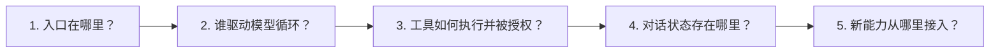

两套系统都能归约成同一个最小闭环：

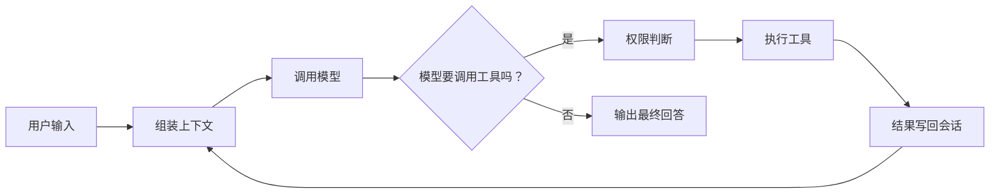

真正的差异不在“有没有循环”，而在循环周围：DeepSeek Harness 把边界做成可替换的插件与能力接缝；Claude Code 把边界收进一个高度优化的产品控制流。

---

## 1. DeepSeek Harness：从插件树到一次完整执行

### 1.1 初学者总览：它不是一个固定 Agent，而是一套 Agent 装配系统

可以把 dsh 理解为五层。越靠上越接近用户，越靠下越接近基础设施；每层的大部分部件都能由 Cordis 插件替换。

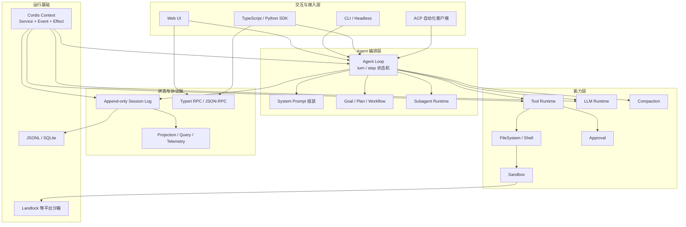

这张图最重要的不是层数，而是箭头背后的控制权：`Agent Loop`、`Tool Runtime`、`LLM Runtime`、`Session Store` 都是挂到 `Cordis Context` 上的服务，不是不可替换的硬编码单例。

源码入口可对照 [02 DeepSeek Harness 架构解读](02-dsh-architecture.md) 的第 1、2、3、5、8、9 节。

### 1.2 启动阶段：配置不是参数集合，而是产品装配图

普通应用的配置常用于改端口或开关；dsh 的配置决定“系统里实际安装哪些部件”。

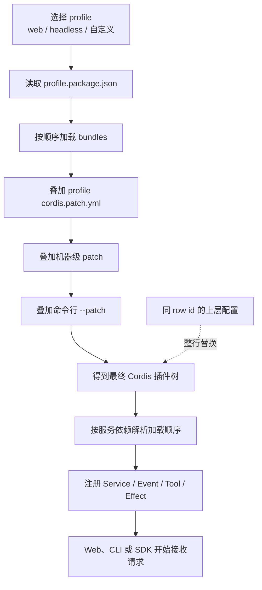

因此，在 dsh 里“换模型”“换沙箱”“换持久化后端”首先是一个装配问题，而不一定需要修改 Agent 循环。`profile → bundle → patch` 是理解整个系统的第一把钥匙。

### 1.3 运行阶段：一次用户请求如何穿过 turn 与 step

`turn` 是用户感知的一轮任务，可能包含多次模型请求；每一次“模型请求 + 工具执行”叫一个 `step`。

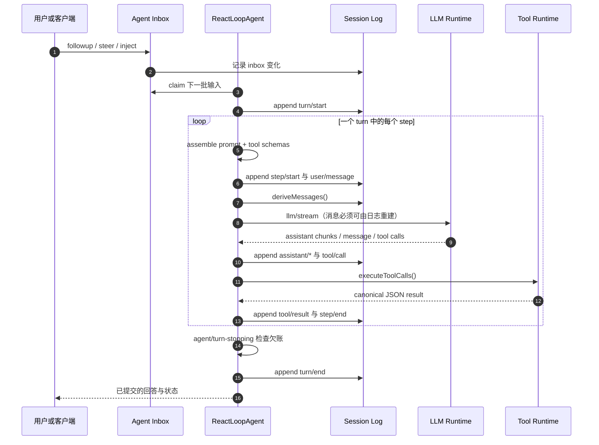

这里有三个容易混淆的点：

1. `followup` 进入下一轮，`steer` 尽快在下一个 step 边界进入，`inject` 只排队但不主动唤醒。
2. 模型看到的历史不是任意内存数组，而是 `session.deriveMessages()` 从日志投影出的结果。
3. 工具结果先成为会话事件，下一步再从会话投影回模型上下文。

### 1.4 控制面：插件怎样在不改循环的情况下改变行为

dsh 把关键节点做成 waterfall。waterfall 不是“广播后不管”，而是 around-middleware：监听者调用 `next()` 才把控制权交给下一层，也可以短路或改写结果。

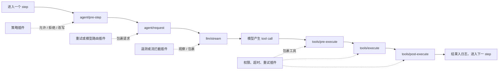

这解释了“一切皆插件”的实际价值：扩展行为不必不断给 `while` 循环添加 `if/else`，而是挂到有明确语义的控制点上。

### 1.5 数据面：为什么说 Session Log 是唯一事实源

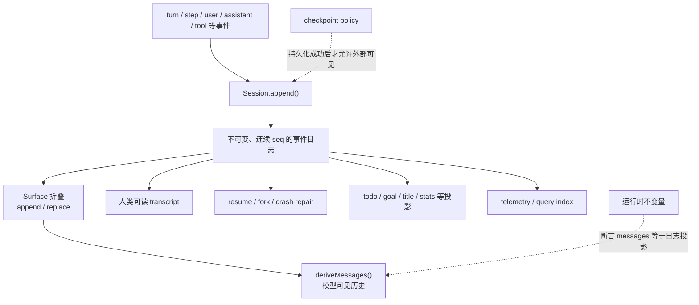

对初学者来说，可以把它类比成银行流水：余额、账单、统计图都能从流水计算，不能让某个页面偷偷维护另一份“真正余额”。压缩也不会删除历史，而是用带来源关系的 `replace` surface 事件改变模型当前看到的窗口。

### 1.6 工具与安全：授权、执行和展示为什么分开

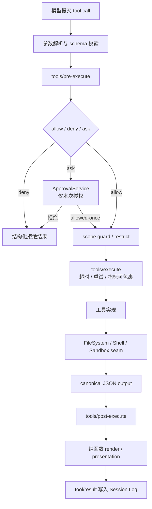

拆分后的收益：安全策略不需要知道 UI 怎样画，UI 重放不需要重新执行工具，工具实现也不需要直接 import React。对于文件和命令执行，沙箱是独立能力边界；如果安全后端不可用，设计目标是显式失败或声明降级，而不是悄悄裸跑。

### 1.7 子代理：同一接口背后可以是完全不同的执行引擎

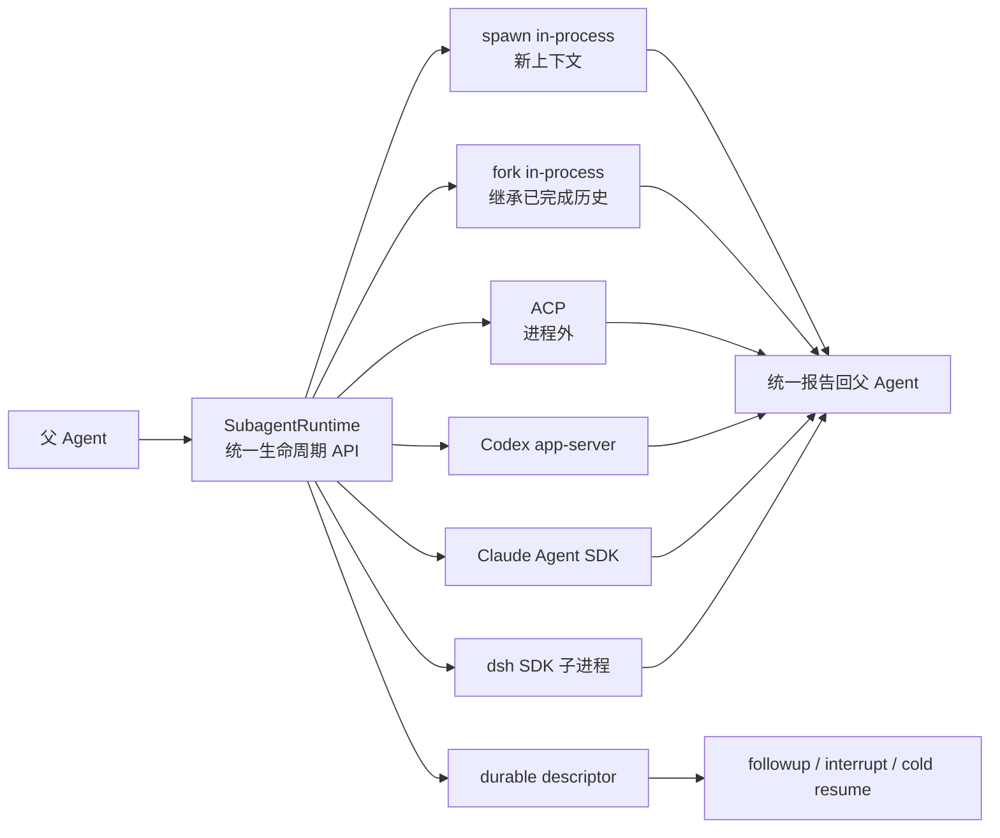

这不是简单的“开几个线程”：`SubagentRuntime` 把“谁来执行”与“父 Agent 怎样管理生命周期”分开，因此同一编排逻辑可以切换本地子 Agent、Codex 或 Claude Code。

### 1.8 dsh 的架构取舍

| 得到什么 | 付出什么 |
|---|---|
| 任意核心能力可替换，适合作为平台或嵌入式运行时 | 插件、scope、事件模式和配置装配的学习成本更高 |
| 会话可审计、可重放，崩溃恢复边界清晰 | 所有模型可见状态都要遵守日志与不变量纪律 |
| 安全、工具、UI 解耦，便于多端复用 | 跨插件追踪一次调用比读单体函数更费力 |
| 多 provider 子代理能接入异构 Agent | provider 生命周期、权限和恢复语义需要统一约束 |

---

## 2. Claude Code：从单循环到产品级控制系统

### 2.1 初学者总览：围绕 query() 打磨出的终端产品

Claude Code 的中心不是插件树，而是 `query()` 这条 async generator 控制流。交互 TUI 与 headless SDK 都消费它产生的事件。

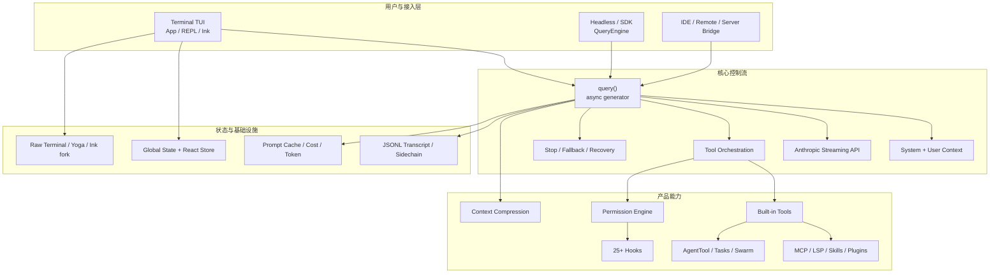

它也有模块化扩展，但目标不是让 `query()` 本身被替换，而是在固定产品骨架上通过 hooks、MCP、skills、agents 和声明式插件增加能力。

源码入口可对照 [03 Claude Code 源码解读](03-claude-code.md) 的第 1、2、3、5、6、7、8、9、10 节。

### 2.2 启动阶段：为什么“进入 REPL 前”就有大量架构工作

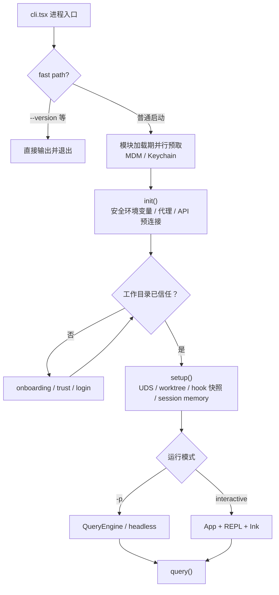

这条启动链体现的是产品安全与性能：不可信目录不能提前触发 LSP 等可能执行代码的能力；昂贵但安全的准备工作尽量并行或推迟，以缩短用户看到首屏的时间。

### 2.3 运行阶段：query() 如何同时服务 TUI 与 SDK

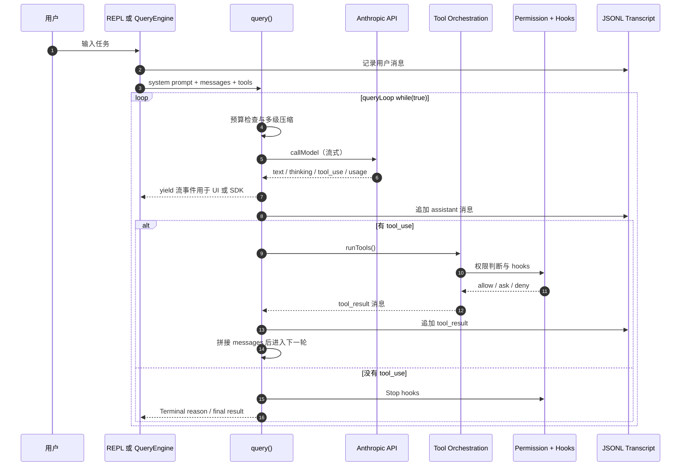

与 dsh 最大的直观差别是：Claude Code 直接重建 `state.messages = [...旧消息, ...assistantMessages, ...toolResults]`；没有单独的事件溯源 surface 再投影一遍。它用更直接的消息控制流换取实现紧凑和 prompt cache 前缀可控。

### 2.4 工具执行：工具在模型看到之前就开始受策略影响

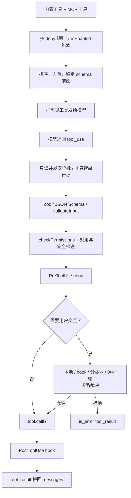

注意两层防线：第一层在工具池组装时就让模型看不到被禁止的工具；第二层在实际调用时根据参数内容、模式和安全规则重新判断。

### 2.5 权限决策：不是一个 yes/no 弹窗，而是一套优先级系统

下面是便于理解的概念顺序；具体分支与模式见 [03 文档第 6 节](03-claude-code.md)。

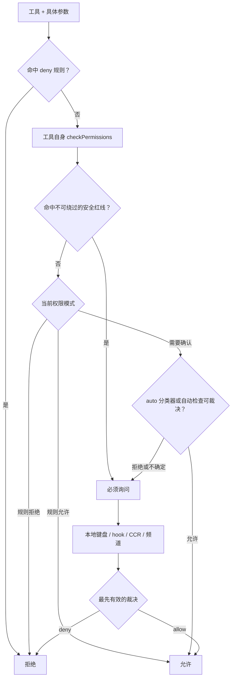

产品层面的好处是普通用户只感知到“该问时问、能自动时自动”，代价是权限语义分散在规则、工具自检、模式、hooks、分类器和交互层之间。

### 2.6 上下文管理：压缩不是一次总结，而是逐级减压

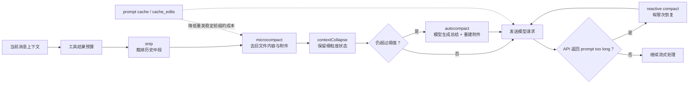

这个设计与 Anthropic prompt cache 深度耦合：工具排序、稳定 system prompt 前缀和 cache breakpoint 都是架构的一部分，而不只是费用优化小技巧。

### 2.7 持久化与恢复：主线程、子代理和产品状态怎样拼回去

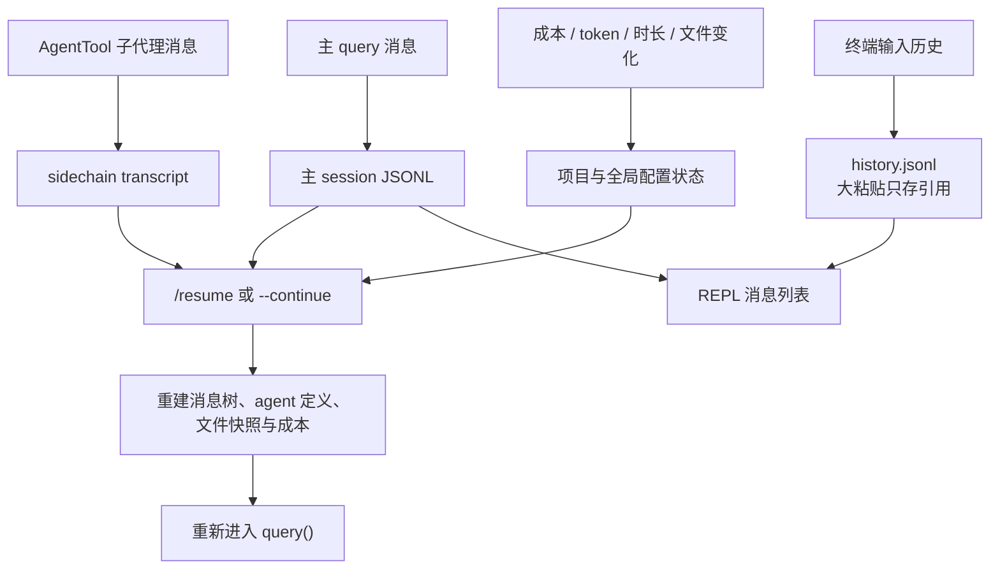

Claude Code 的持久化更像“产品运行记录”：消息转录、sidechain、输入历史、成本状态各有存储，再由 resume 流程组合恢复。

### 2.8 子代理与团队：复用同一循环，而不是换一个运行时

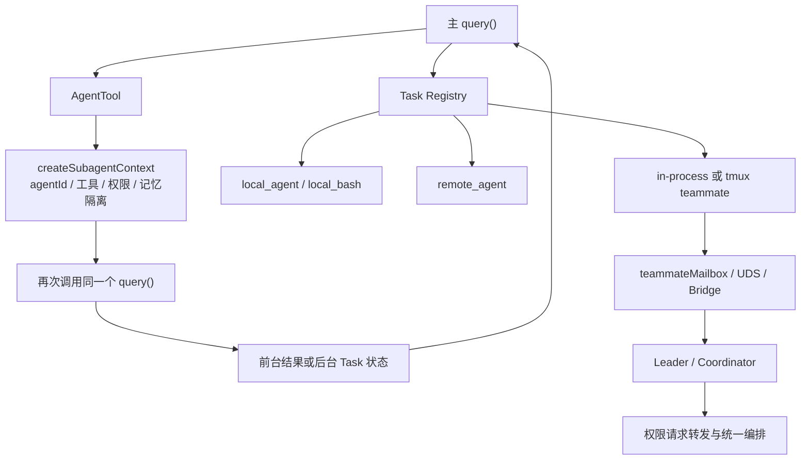

复用 `query()` 的优势是子代理天然继承压缩、hooks、fallback、流式处理和工具编排；限制是所有子代理仍然围绕 Claude Code 的同一产品内核运行，不像 dsh provider 那样天然抽象成异构引擎。

### 2.9 扩展边界：什么能扩展，什么仍由产品内核掌握

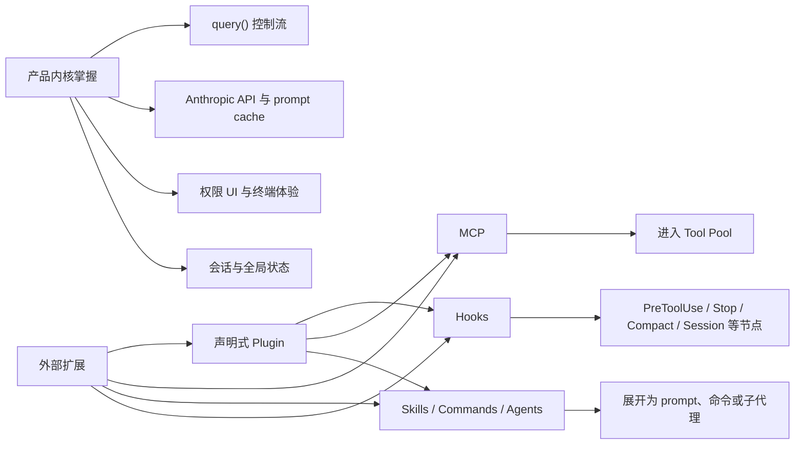

Claude Code 的插件没有任意 JavaScript `main` 去替换内核服务；它通过声明式资源与 hooks 在产品预留的节点上工作。这降低了扩展带来的不可控性，也明确了“可扩展”不等于“核心可替换”。

### 2.10 Claude Code 的架构取舍

| 得到什么 | 付出什么 |
|---|---|
| 单一 `query()` 让交互、headless、子代理共享成熟能力 | 核心循环与 Anthropic 产品假设更难替换 |
| prompt cache、压缩、启动和 TUI 被统一优化 | 优化点跨工具排序、上下文、API 与 UI，耦合较深 |
| 权限体验覆盖规则、分类器、本地与远程裁决 | 想完整理解一次授权需要跨多个模块追踪 |
| hooks、MCP、skills 足以覆盖大量用户扩展 | 扩展只能进入预留边界，不能重组整个运行时 |

---

## 3. 把两套系统放到同一张图上

### 3.1 同一个任务，两条不同的控制路径

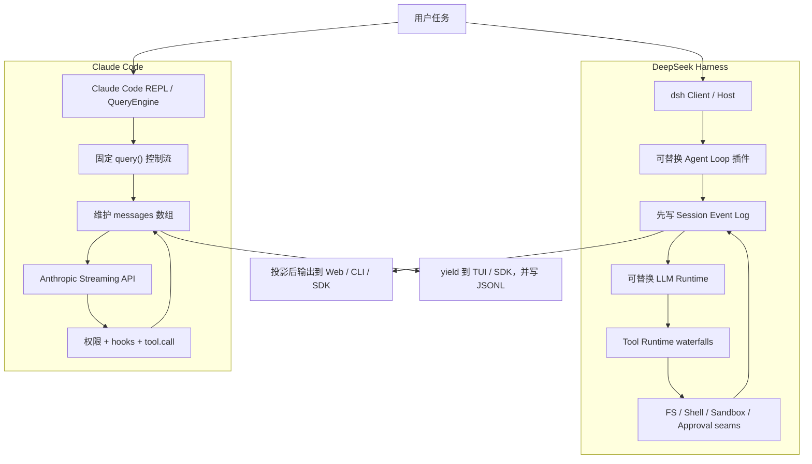

### 3.2 核心概念映射

| 你要找的东西 | DeepSeek Harness | Claude Code | 本质差异 |
|---|---|---|---|
| 主循环 | `ReactLoopAgent` 的 turn / step | `queryLoop while(true)` | 事件化可替换状态机 vs 单控制流产品内核 |
| 模型接口 | `LlmRuntime` + adapter provider | Anthropic API 客户端及云 provider 适配 | 通用能力接缝 vs 深度绑定统一 API 语义 |
| 工具注册 | scoped `ToolRuntime` | 排序后的 `Tool[]` | 作用域服务注册表 vs 稳定 prompt cache 工具池 |
| 工具结果 | canonical JSON → render → session event | `ToolResult` → `tool_result` message | 可重放数据与展示分离 vs 直接消息回填 |
| 权限 | pre-execute waterfall + approval seam | 规则 + 工具自检 + hooks + 分类器 + UI | 框架边界 vs 产品级多层策略 |
| 会话真相 | append-only event log + surface projection | JSONL transcript + 内存 messages | 事件溯源模型 vs 消息转录模型 |
| 子代理 | 多 provider `SubagentRuntime` | AgentTool 复用 `query()` | 异构运行时抽象 vs 同构能力复用 |
| 扩展 | Cordis 插件、service、event、patch | hooks、MCP、skills、声明式 plugin | 可重组内核 vs 扩展固定内核 |
| UI | Host / Client + Typert RPC，Web-first | Ink fork + Raw Terminal，Terminal-first | 多端嵌入 vs 单端体验深挖 |

### 3.3 为什么它们会做出不同选择

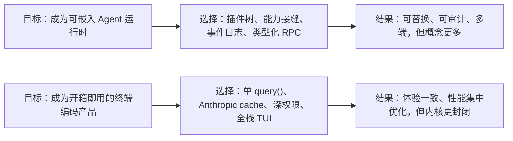

不能只问“哪种架构更先进”。更有效的问题是：

- 如果你在做 Agent 平台、需要换模型/沙箱/子代理后端，dsh 的接缝思路更值得借鉴。
- 如果你在做单一终端产品、想统一优化启动、缓存、权限和交互，Claude Code 的单控制流更直接。
- 如果你只想加一个外部数据源，两者都不需要动主循环：dsh 注册工具或 provider；Claude Code 接 MCP 或 plugin。

---

## 4. 四个具体场景，帮助你把图落回工程

### 场景 A：替换模型供应商

- dsh：实现或选择 `LlmAdapter` provider，在 profile / patch 中替换模型相关插件行；Agent Loop 不需要知道供应商细节。
- Claude Code：通常仍走产品支持的 Anthropic API 兼容路径、Bedrock / Vertex / Foundry 配置；不是替换 `query()` 的插件。

### 场景 B：增加一个文件处理工具

- dsh：定义 canonical output schema、执行函数和纯展示函数，注册进 agent scope；权限与沙箱从工具管线和能力 seam 复用。
- Claude Code：实现 `Tool` 的 Zod schema、`call`、权限检查、并发/只读属性与 React 渲染钩子，或通过 MCP 暴露工具。

### 场景 C：对危险命令增加公司审批

- dsh：在 `tools/pre-execute` 做策略判断，把 `ask` 交给可替换 `ApprovalService`；命令仍经 Sandbox seam 执行。
- Claude Code：组合 permission rules、PreToolUse hook 与交互处理；产品内置的安全红线继续拥有更高优先级。

### 场景 D：进程崩溃后恢复任务

- dsh：恢复 append-only 日志，修补未闭合的 tool / step / turn 事件，再从日志投影模型历史与状态。
- Claude Code：加载主 JSONL 和 sidechain，重建消息树、agent / 文件快照与成本状态，再回到 `query()`。

---

## 5. 推荐阅读路线

### 只想建立直觉（约 20 分钟）

1. [00 给 AI 学习者的导读](00-ai-learning-guide.md)
2. 本文第 1.1、1.3、2.1、2.3、3.1 节
3. [01 深度对比](01-comparison.md) 的结论与架构图附录

### 想自己设计 Agent（约 1–2 小时）

1. 本文完整阅读
2. [02 DeepSeek Harness 架构解读](02-dsh-architecture.md) 第 1–7 节
3. [03 Claude Code 源码解读](03-claude-code.md) 第 2、3、6、7、8、10 节

### 准备改源码

1. 从本文对应场景确定边界
2. 去 02 / 03 的“关键文件速查表”找入口
3. 沿一次真实请求只追一条调用链
4. 最后再展开旁路：缓存、遥测、UI、迁移和 feature flag

> 图负责建立关系，源码负责确认细节。遇到图与未来版本源码不一致时，以对应版本的源码、测试和运行行为为准。
